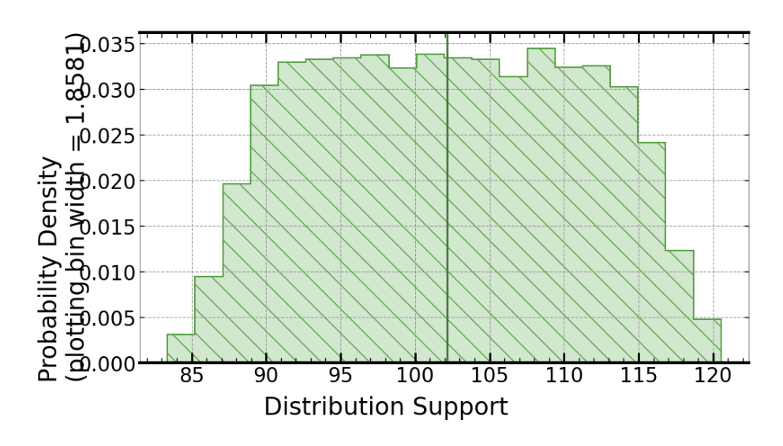

# Development of Safe Braking System for Autonomous Vehicles Using Bayesian Inference
The project is a simplified simulation of a braking system for an autonomous vehicle. It uses a Bayesian approach to estimate the safe distance. It models the stopping distance as a random variable with a prior probability distribution and updates this distribution based on the observed evidence (i.e., the measured distance) using the Bayes' theorem. This approach accounts for the uncertainty and variability in the stopping distance and provides a more accurate estimate of the safe distance. The inspiration was taken from signaloid uncertainty official blogs and libUncertain documentations.

## Inputs:
- `Speed` of the vehicle (in meters per second)
- `Mass` of the vehicle
- `Co-efficient offriction` between tires and road
- `Reaction time` of the driver (in seconds)
- `Prior distribution of the distance` to the obstacle (in meters)
- `Measurement noise` of the sensor (standard deviation in meters)

## Assumptions:

- The braking system can be modeled as a simple equation that relates the safe distance required to apply the brakes with the speed of the vehicle, the reaction time of the driver, and the distance to the obstacle.
- The braking system requires a safety buffer of 2 meters.
- The reaction time of the driver is assumed to be uniformly distributed between 0.5 and 1.5 seconds.
- The prior distribution of the distance to the obstacle is assumed to be uniformly distributed between 0 and 80 meters.
- The measurement noise of the sensor is assumed to be normally distributed with a standard deviation of 2 meters.
- The evidence of the distance to the obstacle is assumed to be fixed at 70 meters.
- The vehicle mass and friction force are assumed to be constant and not included in the current version of the code.
- It's important to note that these assumptions and inputs may not be representative of a real-world autonomous vehicle braking system and should be carefully evaluated and tested before being used in any practical application.

## Output:
Vehicle can safely apply brakes at a distance of 102.173755 meters.
[]

